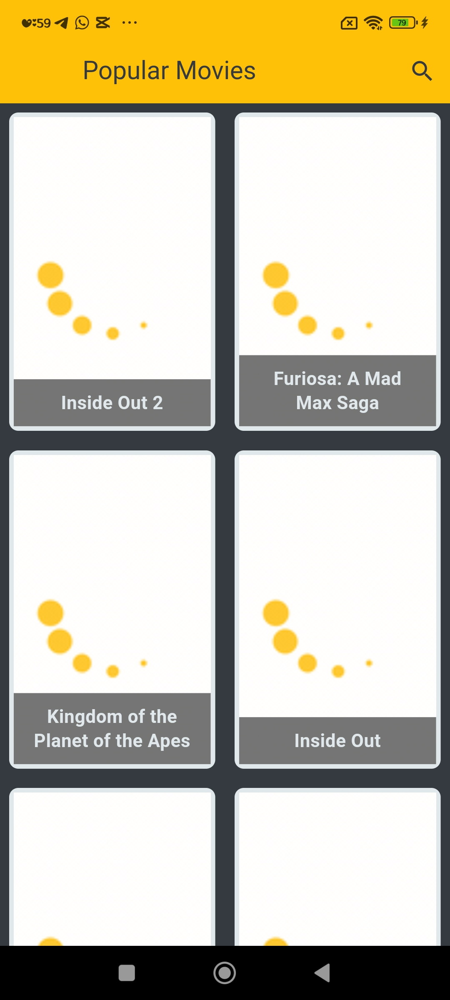
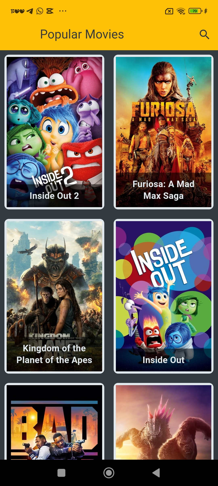
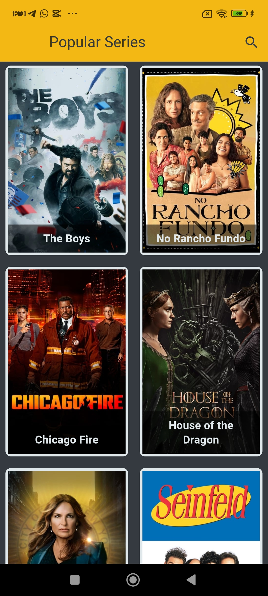
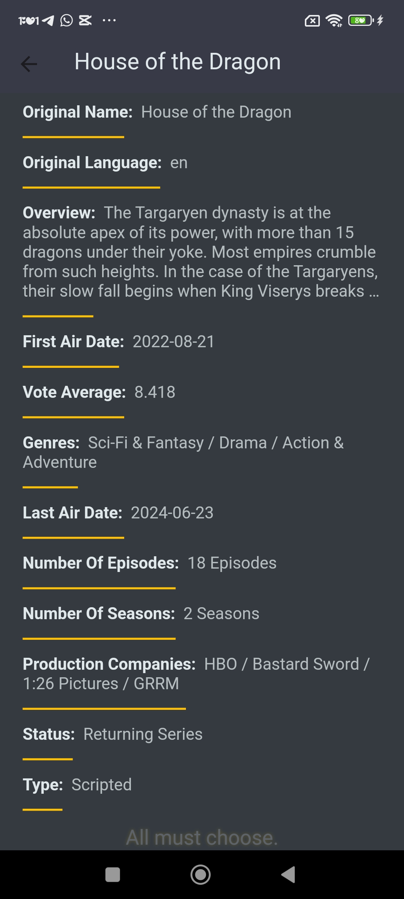
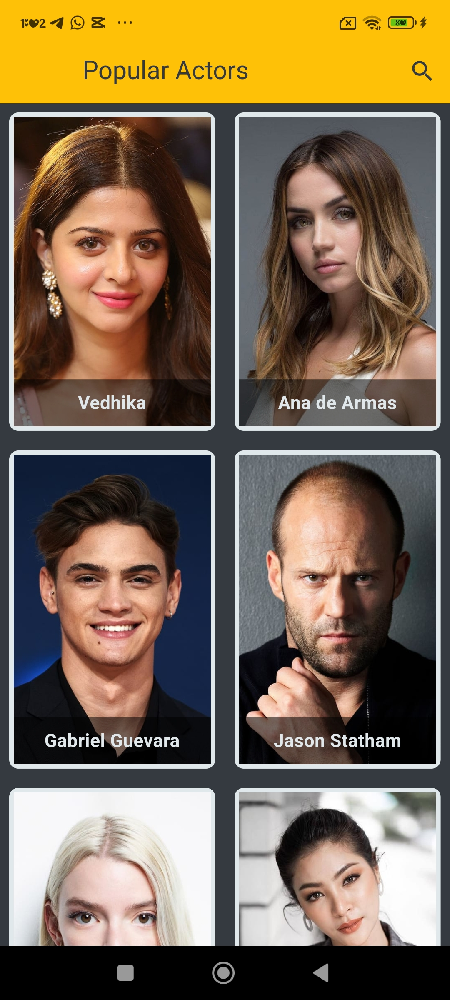

# Tv-App
Application for show movies and series and actors.

## Technologies Used

- **Dart & Flutter**: For building the mobile application.
- **Gitx State Managment**

  
  

  
  
  

  
  
  

  
  

